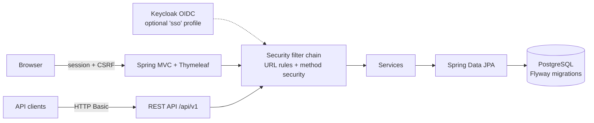

# aerolane


Ops tracker for airport security screening lanes. Officers log equipment inspections, supervisors open/close lanes, auditors pull failure reports — with the permission boundaries between those three roles actually enforced, not just hidden in the UI.

Spring Boot 3 (Java 17) · Spring MVC + Thymeleaf · Spring Security (sessions, RBAC, optional Keycloak SSO) · PostgreSQL + Flyway · REST API · Docker · Kubernetes



## Run it

```bash
docker compose up --build
```

Open http://localhost:8080 — that's it. Postgres and the app come up together, Flyway migrates the schema, demo data seeds itself.

| Role | Username | Password | Can do |
|---|---|---|---|
| Officer | `officer` | `officer123` | Log inspections, view everything operational |
| Supervisor | `supervisor` | `supervisor123` | Everything + open/close lanes + reports |
| Auditor | `auditor` | `auditor123` | Read-only + failure reports |

Demo credentials are intentionally public. Don't reuse this pattern anywhere real.

## What each role sees

The same app behaves differently per role, enforced in two layers: URL rules in the security filter chain, and `@PreAuthorize` on the service methods behind them. Hiding a button is cosmetic; the service saying no is the actual control. Try logging in as `auditor` and POSTing an inspection over the API — you get a 403 even though the endpoint exists.

## REST API

Interactive docs at http://localhost:8080/swagger-ui.html once running. Auth is HTTP Basic per request.

| Method | Path | Who | What |
|---|---|---|---|
| GET | `/api/v1/lanes` | any authenticated | List lanes |
| GET | `/api/v1/lanes/{id}` | any authenticated | One lane |
| PATCH | `/api/v1/lanes/{id}` | supervisor | Change lane status |
| GET | `/api/v1/inspections` | any authenticated | List, filter with `?result=FAIL` or `?laneId=1` |
| GET | `/api/v1/inspections/{id}` | any authenticated | One inspection |
| POST | `/api/v1/inspections` | officer, supervisor | Log an inspection |
| GET | `/api/v1/reports/summary` | auditor, supervisor | Totals, fail rate, failures by equipment |

```bash
curl -u officer:officer123 http://localhost:8080/api/v1/lanes
curl -u supervisor:supervisor123 -X PATCH http://localhost:8080/api/v1/lanes/1 \
  -H "Content-Type: application/json" -d '{"status":"CLOSED"}'
```

Validation failures come back as structured 400s with per-field messages, unknown IDs as 404s, bad enum values as 400s — see `ApiExceptionHandler`.

## Security notes

- Form login with server-side sessions for the browser (30 min timeout, HttpOnly + SameSite cookies, session fixation protection). HTTP Basic for API clients, which get a clean 401 instead of a login-page redirect.
- CSRF protection on for the UI, skipped for `/api/**` since those clients authenticate per request.
- Content-Security-Policy, X-Frame-Options deny, and the rest of Spring Security's header defaults.
- Passwords hashed with BCrypt. The SSO-only demo user gets a random unusable password so nobody can form-login as them.

### SSO (Keycloak, optional)

The `sso` profile adds OIDC login next to form login. Keycloak proves who you are; the local `app_users` table decides what you can do — unknown SSO identities authenticate but hold no role (least privilege).

```bash
docker compose --profile sso up db keycloak   # Keycloak on :8180, realm auto-imported
mvn spring-boot:run -Dspring-boot.run.profiles=sso
```

Then hit "Sign in with SSO" and use `sso.officer` / `ssopass123`. The app runs on the host for this demo so the browser and the app agree on the issuer URL (`localhost:8180`) — the classic OIDC-in-compose networking gotcha, documented here instead of hidden.

## Database

Schema lives in versioned Flyway migrations (`src/main/resources/db/migration`), validated against the JPA entities on boot (`ddl-auto: validate` — Hibernate never generates schema here). Default profile runs H2 in PostgreSQL mode so `mvn test` needs no database; the `postgres` profile is what Docker and k8s run.

## Tests

```bash
mvn test
```

Unit tests (service logic with Mockito), full-context security tests (role boundaries over MockMvc against the real filter chain), and API contract tests (validation errors, 401 vs 403 vs 404 semantics). CI runs them on every push — GitHub Actions is primary, and there's an equivalent `Jenkinsfile` for Jenkins shops.

This app is also the target of [checkride](https://github.com/rajanshxrma/checkride), a standalone QA automation framework that black-box tests it: REST Assured API suites, Selenium UI flows, Testcontainers integration runs, Gatling load tests.

## Kubernetes

```bash
docker build -t aerolane:0.1.0 .
kind load docker-image aerolane:0.1.0     # or: minikube image load aerolane:0.1.0
kubectl apply -f k8s/
kubectl -n aerolane port-forward svc/aerolane 8080:80
```

Manifests cover namespace, Postgres with a PVC and secret-sourced credentials, and the app deployment with readiness/liveness probes against `/actuator/health`, resource requests/limits, and config split between ConfigMap and Secret.

## Project layout

```
src/main/java/com/aerolane/
  config/      security filter chains, OIDC role mapping, demo data seeder
  model/       JPA entities (AppUser, Lane, Inspection)
  repository/  Spring Data repositories
  service/     business logic + @PreAuthorize rules
  web/         MVC controllers + form objects (Thymeleaf)
  api/         REST controllers, DTOs, exception handler
src/main/resources/db/migration/   Flyway SQL
k8s/           Kubernetes manifests
keycloak/      dev realm for the SSO profile
```
